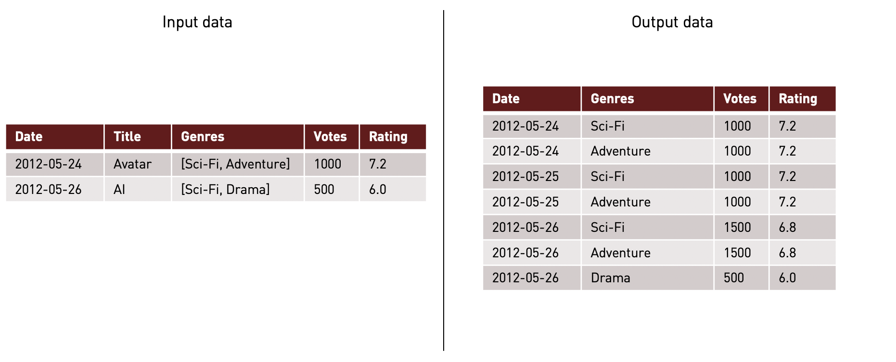

# The movie dataset - Spark processing

A sample spark project for processing The Movie Dataset. 

---

Last version generated: 1.0.0

---

## Prerequisites

 - Java 8
 - Scala 2.11
 - Maven 3
 - Spark 2.4.2

## Maven Lifecycle

### Compile

```bash
mvn clean install
```

### Test

```bash
mvn clean test
```

### Scoverage

```bash
mvn clean scoverage:report
```

### Scala Style

```bash
mvn clean scalastyle:check
```

## Input data

Input data has been taken from Kaggle datasets. For getting more info about it visit URL 
https://www.kaggle.com/tmdb/tmdb-movie-metadata#tmdb_5000_movies.csv


## Run

```bash
spark-submit --class org.sergiocc.tmdb.job.GenreRankingJob tmdb-movie-dataset-spark-1.0.0.jar \
             --input-table ./inputData/tmdb_5000_movies.csv \
             --output-table /tmp/tmdb/tbl-genre-ranking \
             --output-table-name tbl_genre_ranking
```

## Output model

### Genre ranking table

This table contains historical data aggregated per genre, calculating weighted averaged ratings. The table stores all 
genre ratings per day accumulating all movies rated until processing date. A transformation example is shown below:



Output table columns are shown below:

| Column name  | Column type | Description                                                |
|--------------|-------------|------------------------------------------------------------|
| date         | integer     | Date, in format YYYYMMDD. Column used as partition column. |
| genre_id     | string      | Genre ID.                                                  |
| genre_name   | double      | Genre name.                                                |
| vote_count   | double      | Number of total votes per genre until date.                |
| vote_average | integer     | Weighted average vote rating per genre until date.         |